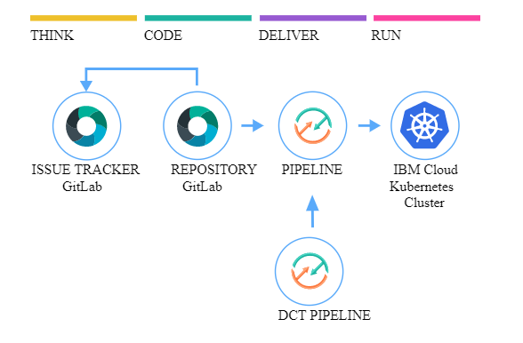

#  Develop a Kubernetes app

### Leverages Docker image signing to validate image integrity
This template expands upon the existing Secure-kube-toolchain template  with the addition of extra validation controls on the Docker image. Digital signatures are applied to the Docker image at specific validation stages. An image security enforcement policy is applied to the Kubernetes cluster requiring the signatures to be present before proceeding with the deployment. This toolchain requires the use of a Key-Protect vault instance that has been pre-populated with signing keys. See key-management-admin-toolchain (https://github.com/open-toolchain/key-management-admin-toolchain)

### Continuously deliver a secure container app to a Kubernetes Cluster
This Hello World application uses Docker with Node.js and includes a DevOps toolchain that is preconfigured for continuous delivery with Vulnerability Advisor, Docker image signing checking, source control, issue tracking, and online editing, and deployment to the IBM Kubernetes Service.

Application code is stored in source control, along with its Dockerfile and its Kubernetes deployment script.
The target cluster is configured during toolchain setup (using an IBM Cloud API key and cluster name). You can later change these by altering the Delivery Pipeline configuration.
Any code change to the Git repo will automatically be built, validated and deployed into the Kubernetes cluster.

### To get started, click this button:

It implements the following best practices:
- sanity check the Dockerfile prior to attempting creating the image
- apply Docker signature after Docker unit tests, sanity checks and successful build
- build container image on every Git commit, setting a tag based on build number, timestamp and commit id for traceability
- use a private image registry to store the built image, automatically configure access permissions for target cluster deployment using API tokens than can be revoked
- check container image for security vulnerabilities and add an additional Docker signature upon successful completion
- insert the built image tag into the deployment manifest automatically
- use an explicit namespace in cluster to insulate each deployment (and make it easy to clear, by "kubectl delete namespace")
- checks for the presence of the two signatures before proceeding with the deployment

---
### Learn more 

* Blog [Continuously deliver your app to Kubernetes with Bluemix](https://www.ibm.com/blogs/bluemix/2017/07/continuously-deliver-your-app-to-kubernetes-with-bluemix/)
* Step by step [tutorial](https://www.ibm.com/devops/method/tutorials/tc_secure_kube)
* [Getting started with clusters](https://cloud.ibm.com/docs/containers?topic=containers-getting-started)
* [Getting started with toolchains](https://cloud.ibm.com/devops/getting-started)
* [Documentation](https://cloud.ibm.com/docs/services/ContinuousDelivery?topic=ContinuousDelivery-getting-started&pos=2)
